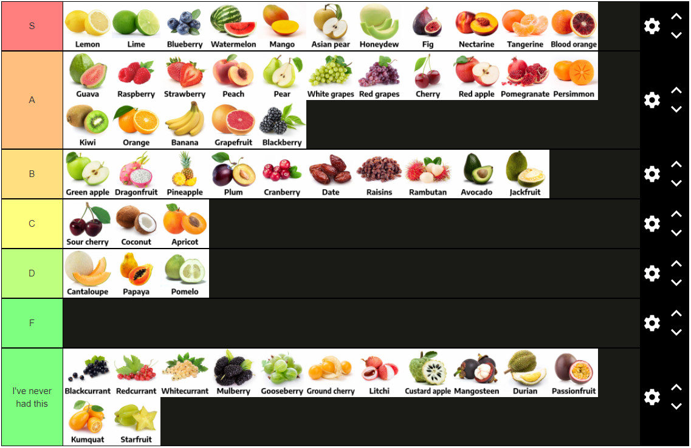

{"category": "project", "dateCreated": "Aug 2021", "title": "Ben Eater 8-Bit Computer", "tags": ["computing", "8-bit", "electronics", "effects", "hardware"], "desc": "Built Ben Eater's 8-bit computer.", "icon" : "fas fa-square"}
<article>
This document serves to show examples of all embeddable content on my site. Please enjoy!

## Tables

| Apple Type   | Cost per lb. |
| ------------ | ------------ |
| Gala         | $ 1.49       |
| Pink Lady    | $ 1.79       |
| Granny Smith | $ 1.29       |

 
## Code (w/automatic syntax highlighting)

```py
# Example code that shows the functionality of 'prettyprint'.
class Example:

def __init__(self):
self.color       = 0xFc3ef3
self.flavor      = 'strawberry'
self.favoriteNum = 1388

def printOneToTen(message):
''' Documentation goes here (in the docstring)
'''
for n in range(0,10):
print(n)

# Sample comment
if message == 'Hello World!':
return 'Exit'
```

 
## Math (\\(LaTeX)\\)

When \\(a \ne 0\\), there are two solutions to \\(ax^2 + bx + c = 0\\) and they are
$$\begin{equation}x = {-b \pm \sqrt{b^2-4ac} \over 2a}.\end{equation}$$

<!--
## Chess

<div class="row">
    <div class="col col-lg-6 col-md-12 col-sm-6">
        <div class="chess">
            <iframe src="https://lichess.org/embed/IjFEjP3W#86?theme=auto&bg=auto"
                    width=800 
                    height=500
                    frameborder=0>     
            </iframe>
        </div>
    </div>
</div>-->

 
## Video

<div class="embed-wrapper video">
    <iframe src="https://www.youtube.com/embed/dFUYsbbf6U0" 
            width="100%" 
            height="100%" 
            title="YouTube video player" 
            frameborder="0" 
            allow="accelerometer; 
                   autoplay; 
                   clipboard-write; 
                   encrypted-media; 
                   gyroscope; 
                   picture-in-picture" 
            allowfullscreen>
    </iframe>
</div>

 
## Spotify
<div class="row">
    <div class="col col-lg-4 col-md-4 col-sm-12">
        <iframe src="https://open.spotify.com/embed/album/1DFixLWuPkv3KT3TnV35m3"        width="300" 
                height="545" 
                frameborder="0" 
                allowtransparency="true" 
                allow="encrypted-media">
        </iframe>
    </div>
</div>

 
## Images/Figures
<div class="row">
    <div class="col col-lg-9 col-md-12 col-sm-12">
        <figure class="figure">
            
            <figcaption class="figure-caption">
                My fruit tier list.
            </figcaption>
        </figure>
    </div>
</div>

Incidentally, here's more text. 
</article>