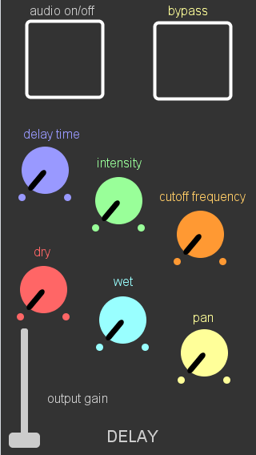
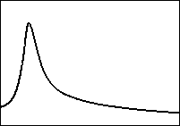
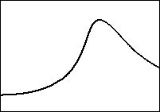
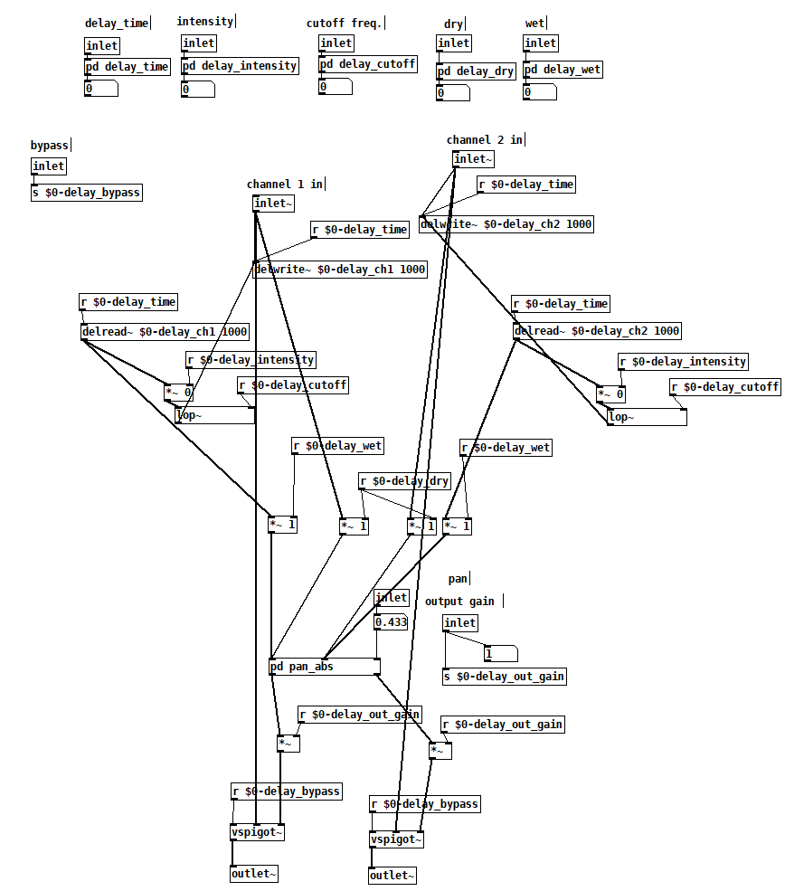

{"category": "project", "dateCreated": "Dec 2020", "title": "Mobile Real-Time Audio Effects Unit", "tags": ["puredata", "audio", "pedal", "effects", "hardware", "software"], "desc": "A mobile GUI, backend, and hardware application that processes and outputs real-time audio inputs.", "icon" : "fas fa-square"}

<article>

    

        <figure class="figure">
            
            <figcaption class="figure-caption">
                Figure 1: The mobile UI of the delay pedal.
            </figcaption>
        </figure>
    

How do traveling musicians find time to practice?

This project seeks to solve this problem by simulating multiple effect pedals on a common mobile device, allowing musicians to have a full pedalboard experience anywhere at anytime.

## Overview
The effects available to the end user are wah-wah, distortion, chorus, delay, and reverb.

The DSP backend is coded in PureData, which wraps C in a visual programming style that allows for rapid development of DSP code. The end result can easily be used in conjunction with C/C++, allowing for a product widely compatible with a number of platforms (embedded and general purpose).

To interface with a mobile UI, the Mobile Music Platform (<a href="https://danieliglesia.com/mobmuplat/" class="text-link">MobMuPlat</a>) is used to link front-panel controls with the audio backend via OSC messaging.

For expressive wah-wah control, the phone tilt sensor is employed to allow users to place their phone somewhere underfoot and actuate it to achieve a continuous "pedal" experience.

    

        <figure class="figure">
            
            <figcaption class="figure-caption">
                Figure 2: The wah-wah frequency response in heel position.
            </figcaption>
        </figure>
    

    

        <figure class="figure">
            
            <figcaption class="figure-caption">
                Figure 3: The wah-wah frequency response in toe position.
            </figcaption>
        </figure>
    

## A Single Effects Stage

    

        <figure class="figure">
            
            <figcaption class="figure-caption">
                Figure 4: A single stage (delay) used in the assembly of the entire audio effect chain.
            </figcaption>
        </figure>
    

    

        <figure class="figure">
            
            <figcaption class="figure-caption">
                Figure 5: The backend of the delay pedal, wrapped in the "delay_pedal" abstraction in Figure 4.
            </figcaption>
        </figure>
    

Each stage inputs and outputs stereo signal. Let's focus on one stage (the delay stage):
<ul>
<li>The external "receive" commands in Figure 4 get OSC messages from the frontend...</li>
<li>...and pass them to the row of "inlets" at the top of Figure 5. </li>
<li>A delay line is opened using "delwrite~" and "delread~", saving the delay sample in memory for the desired delay length.</li>
<li>A lowpass filter "lop~" is applied to consecutive delay instances.</li>
<li>The volume of consecutive delay instances is decreased each time.</li>
<li>The pan abstraction "pan_abs" allows the user to pan each effect.</li>
<li>The final gain stage lets the user control the output of each effect.</li>
</ul>

## Top-Level Design
A similar template is used for all other effects in the signal chain. Since they are abstractions, they can be rearranged to any order. On-the-fly rearrangement is a noted goal for future development.

Since PureData allows you to use multiple inputs, the PureData GUI sliders are used to debug the patch alongside the OSC messages. This makes iterative development very simple, as there are always controls available to the developer.

Please <a class="text-link" tabindex = 0 onclick="copyToClipboard()" data-bs-toggle="popover" data-bs-trigger="focus" data-bs-content="Email copied to clipboard!">
contact me
  </a> if you would like to try this project for yourself, or have any questions!

</article>
